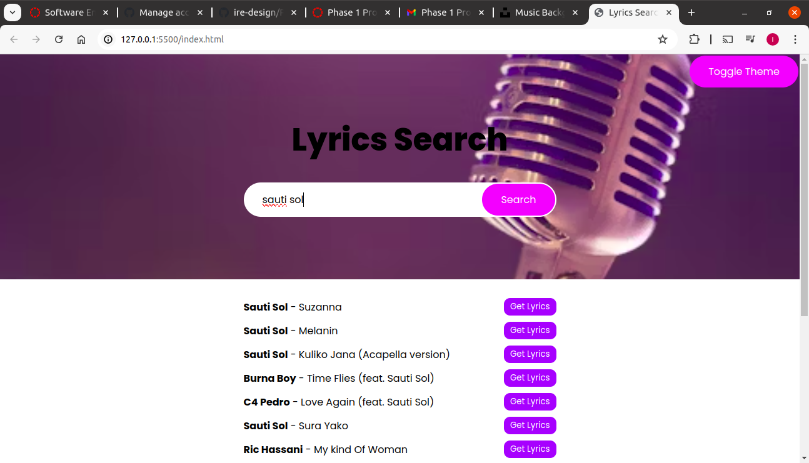
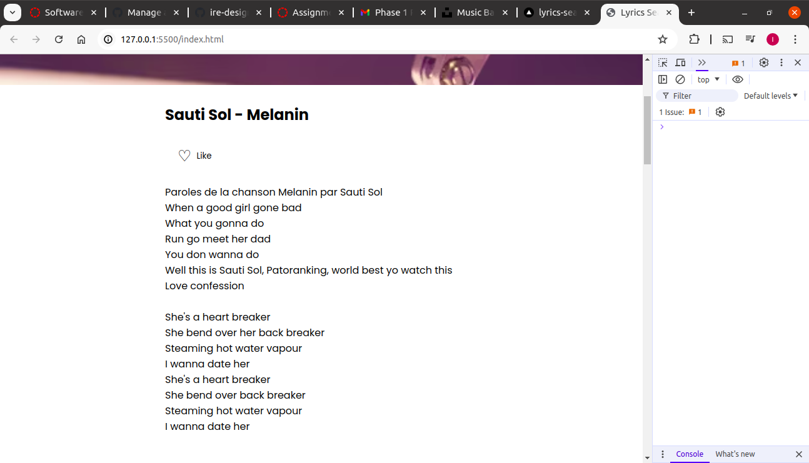
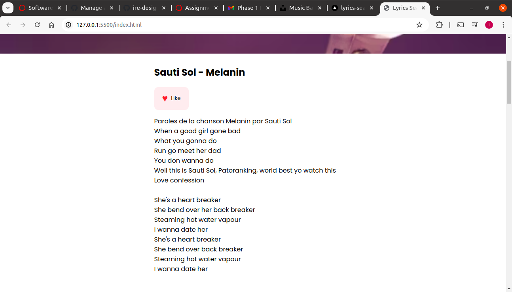
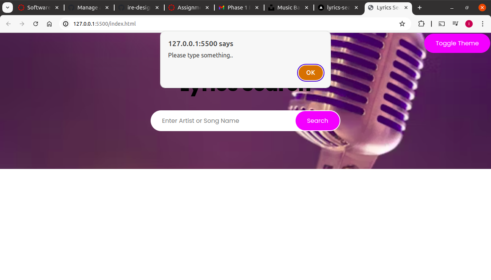

# PROJECT
# Author: Irene Musau

# Lyrics Search
## Deployment
- Project deployed link: https://lyrics-search-project.vercel.app/
- Demo link : https://www.loom.com/share/2f1b63a203724db29e5d39045355f475?sid=87e6f4f3-539a-42c3-aeb6-ff012cc140fb

A dynamic web application that allows users to search for song lyrics using artist names or song titles.

## Features

- Search for songs by artist or title
- View song lyrics
- Like/unlike songs
- Toggle between light and dark themes

## How It Works

1. **Search Functionality:**
   - Users enter an artist name or song title in the search bar.
   - The application queries the Lyrics.ovh API to fetch matching songs.
   - Results are displayed as a list of songs with artist names and titles.
   

   

2. **Lyrics Display:**
   - Users can click the "Get Lyrics" button next to any song in the search results.
   - The application fetches and displays the full lyrics for the selected song.
   

3. **Like Feature:**
   - Each song's lyrics display includes a "Like" button.
   
   
   - Users can like or unlike a song by clicking this button.
   - The heart icon changes color and the button background updates to indicate the liked state.
   

4. **Theme Toggle:**
   - A "Toggle Theme" button allows users to switch between light and dark modes.
   - This affects the overall color scheme of the application for better user experience in different lighting conditions.

## Error Handling

The application includes several error alerts to guide users:

- If the search field is empty when submitted, an alert says "Please type something..".
- If no results are found for a search term, the results area will display "No results found".
- In case of API errors, appropriate error messages will be displayed to the user.

## Technologies Used

- HTML5
- CSS3
- JavaScript (ES6+)
- Lyrics.ovh API for song data and lyrics

## Setup and Installation

1. Clone the repository to your local machine.
2. Open the `index.html` file in a web browser.
3. No additional installation or setup is required as the application runs entirely in the browser.

## Future Improvements

- Add user accounts to save liked songs
- Implement a playlist creation feature
- Enhance mobile responsiveness for better experience on smaller devices

## Credits

- Background images from Unsplash
- Fonts from Google Fonts
- Lyrics data provided by Lyrics.ovh API

## License

This project is open source and available under the [MIT License](LICENSE).